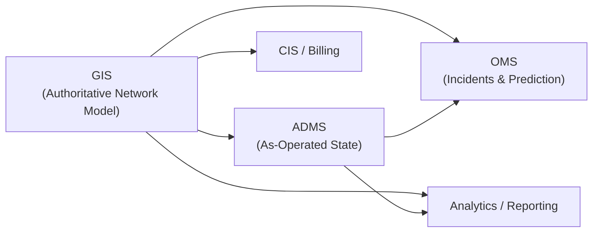

## OMS is only as good as its model

At Hometown Electric and Light in Hometown ABC, one of the worst recent outages on paper didn’t look that bad. A single feeder issue on a calm day. The OMS confidently drew an outage polygon, identified a likely fault location, and generated work. Crews rolled, calls came in, and everyone expected a quick restore.  

What actually happened was a mess. The predicted fault location was off by a lateral, customers at the edge of the event never showed up in the OMS view, and dispatch ended up relying on a mix of calls, SCADA, and handwritten notes to figure out what was really out. Nothing was wrong with the OMS engine itself. The problem was that the network model it trusted did not match what was actually built and operated in the field.

## The role of GIS and ADMS in OMS

### GIS: where the network actually lives

GIS is where the network should live as data, not just as drawings. It holds where assets are, how they connect, and how you can trace from a source down to an individual service point. That includes connectivity, topology, IDs, phasing, and device capabilities – all the things operations relies on but can’t maintain by hand.  

If GIS doesn’t manage connectivity and topology in a consistent, validated way, you don’t really have a network model. You have map art. OMS and ADMS will still build internal structures, but they’ll be based on incomplete or inconsistent inputs. Every workaround you add in downstream systems instead of fixing GIS turns into another place the truth can drift.

### ADMS: as-operated view on top of that

ADMS takes that base model and adds as-operated state. It knows which switches are open or closed, how feeders are currently configured, and which schemes are in effect today versus what’s on the design print. Where GIS is about what’s built and energized, ADMS is about how it’s being run right now.  

That view still depends on clean IDs and topology from GIS. If device identifiers or feeder definitions don’t line up, operators end up translating between systems during every switching order. The more ADMS has to invent its own naming or topology to cope, the harder it is to reconcile anything back to the source.

### OMS: incident and prediction layer

OMS sits on top as the incident and prediction layer. It doesn’t need to be the best network modeling tool, but it does need to trust a good one. Its job is to take trouble tickets, SCADA alarms, and customer calls, and turn that into likely fault locations, outage extents, and work to restore service.  

Everything OMS predicts depends on two things: the events it sees and the model it believes. When the model is wrong, you get impossible outages on the map, customers missing from events, and switching steps that look fine on the screen but don’t line up with field conditions. Once that happens enough, people stop trusting the system and fall back to manual reasoning.

## Integration patterns that work

### One network model, multiple consumers

The pattern that holds up best over time is simple: one network model, many consumers. GIS owns the core asset and connectivity data. ADMS and OMS consume it, add the operational state they need, and feed back issues without forking their own version of the network.  

That doesn’t mean OMS and ADMS can’t optimize how they store or index data. It does mean they don’t invent separate device IDs, feeder definitions, or customer attachments. Any time a “quick fix” in a consuming system creates a new data path that doesn’t go through GIS, you’ve effectively created a second model to maintain.

### Robust GIS → OMS synchronization

To make OMS feel like a direct extension of the network model, not a copy, you need a predictable synchronization pattern. In practice that usually looks like:  

- A stable, operationally-focused extract from GIS (not every design in progress) that represents the energized network.  
- A regular, agreed schedule for loading that extract into OMS (daily at minimum, plus an approach for urgent changes) with clear criteria for when it is safe to apply.  
- Validation and guardrails that block or flag changes which would orphan customers, break feeder paths, or introduce devices with no path back to a source.  

The plumbing can be file drops, APIs, or an integration bus. The important part is that GIS and OMS share the same lifecycle and that people know which day’s network they’re looking at.

### OMS and ADMS walking in lockstep

When OMS and ADMS share the same network model and device identities, they can act like two views of the same system instead of separate tools. An OMS outage prediction can be checked against ADMS telemetry. Planned switching in ADMS can be reflected directly in OMS customer communications and ETAs. Crews don’t have to mentally reconcile two different diagrams.  

Keeping them in lockstep means treating key changes – topology updates, major device state changes, feeder reconfigurations – as shared events. If ADMS sees a switch open and OMS still thinks the feeder is closed through that point, you’ll get bad predictions and confusing work. The integration work is making sure those two systems stay aligned as the network and operations evolve.

## Failure patterns when OMS has its own model

When OMS starts acting like a separate mini‑GIS, a few patterns show up quickly:

- Divergent network models: Feeders split or reconfigured in GIS still appear in their old form in OMS, so outages spill across boundaries that no longer exist.  
- Orphaned customers and wrong outage extents: Customers added or moved in GIS never make it to OMS, so their calls land in generic “unmapped” buckets or get attached to the wrong event.  
- Local fixes that never reach GIS: Someone patches a bad device or feeder definition directly in OMS or ADMS to get through an incident. That change doesn’t go back to GIS, and the next load either overwrites it or drifts further away.  
- Shadow documentation: Teams maintain side spreadsheets or tribal knowledge about which devices correspond across systems, where the map is trustworthy, and which areas of the network model are “weird.” That’s usually a sign the integration story is not doing its job.

Once those habits are in place, any new project that touches OMS or ADMS has to spend a lot of time just figuring out which system to believe, and everyone pays that tax over and over.

## Designing for operations, not interfaces

It’s easy to reduce GIS–OMS–ADMS integration to formats, APIs, and schedules. Operations feels it in a different way: either they trust what the system is showing them, or they don’t. If they don’t, everything slows down.  

Designing for operations means treating the network model as a shared operational asset, not just an IT data set. That includes clear ownership, change management that involves operations, and validation that looks for the kinds of problems that cause bad outages and bad switching – missing connectivity, mismatched IDs, suspicious shifts in customer counts. Simple QA views that show “customers without a path to source,” “devices changed in OMS/ADMS but not in GIS,” or “feeders with sudden customer swings” give people a way to see drift early instead of finding it in the middle of an event.

## Executive takeaways

- Make GIS the authoritative network model and hold OMS and ADMS to it rather than letting each system evolve its own version.  
- Put a formal, versioned GIS → OMS/ADMS sync process in place with clear guardrails instead of informal, ad‑hoc file exchanges.  
- Align device, feeder, and customer identities across GIS, ADMS, and OMS so one ID means the same thing everywhere.  
- Stand up basic operational QA dashboards that surface model drift before it shows up as wrong predictions or unsafe switching.  
- Require that permanent fixes go through GIS and the agreed integration path instead of staying as local patches in consuming systems.  
- Make network model quality a shared metric across GIS, operations, and IT leadership, not something owned by a single team.  
- Fund integration and model governance as part of reliability and customer‑experience work, not just as a one‑off IT project.