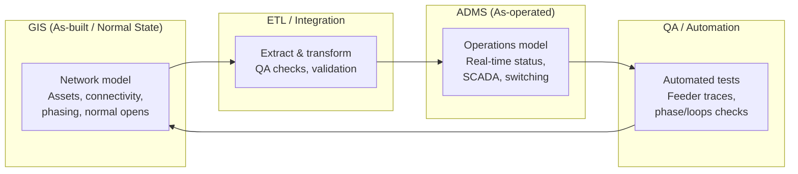

## Why “ADMS integration” isn’t the same as readiness

A lot of ADMS projects get “integrated” on paper long before they’re actually ready for operations. Connectivity is loading, the map draws, devices look roughly correct, and everyone is tempted to declare victory. Then the first serious outage or switching plan shows up and you discover that traces fall apart, phases are wrong, and operators don’t trust what they see on the screen.  

ADMS projects are huge undertakings that pull in people from operations, protection, planning, GIS, IT, and vendors. It’s very easy to confuse “we can load data” with “the model is actually ready for operators.” Those are not the same thing. The gap between the two is where most delays, rework, and late‑stage surprises live.

## What ADMS actually needs from GIS

For ADMS, GIS isn’t just a background map. It’s the starting point for the network model that the system uses to reason about switching, outages, and power flows. That means a few things have to be true before you can call the GIS→ADMS integration “ready.”

- **Connectivity and topology.**  
  Devices and conductors must be connected in a way that supports correct traces from sources to end customers. That includes valid paths, correct normal open points, and no mystery gaps or loops that only “work” because ADMS is doing a lot of guesswork in the background.

- **Phasing and voltage integrity.**  
  Phase information needs to be present, consistent, and usable. ADMS can’t optimize or even safely propose switching if it doesn’t know what phases are present where, or if the voltage levels and phase designations disagree across the model.

- **Device modeling (switches, breakers, etc.).**  
  Switches, breakers, regulators, reclosers, and other key devices must be modeled with the attributes ADMS actually uses: status, normal state, control type, ratings, relationships to telemetry points, and so on. “Looks right on the map” is not enough; the device has to behave correctly in the model.

## A practical ADMS readiness checklist

You don’t need a perfect model to go live, but you do need a provable baseline. A practical readiness checklist looks something like this:

- **Feeder trace success.**  
  For each in‑scope feeder, you can trace from the source through to all modeled customers without unexplained breaks, dead‑end islands, or “unknown” segments. Exceptions are documented and understood, not surprises.

- **Phase and voltage completeness.**  
  Phase and voltage are populated to the level required for the ADMS functions you plan to use on day one. Missing or inconsistent phase data is the exception, not the norm, and you know where those exceptions are.

- **Modeling consistency.**  
  Similar devices are modeled in similar ways. You don’t have five different patterns for how a two‑way switch or a voltage regulator is represented. That consistency matters when you start writing rules, running traces, and troubleshooting.

- **Attribute completeness.**  
  The key attributes ADMS depends on (IDs, normal status, control groups, telemetry links, etc.) are present and within acceptable quality thresholds. You’ve defined what “good enough” looks like and you’ve checked it, not just assumed it.

- **Scenario validation.**  
  You’ve run through a small set of realistic operational scenarios (outages, planned switching, device failures) and validated that the model behaves in a way that operators recognize. This is where you find out if your “valid traces” are actually usable.

## Integration patterns that keep ADMS and GIS aligned

Getting to readiness once is hard. Staying ready is harder. The way you integrate GIS and ADMS over time matters as much as the initial load.

- **Batch vs. incremental updates.**  
  During development, you want to fail fast. Use frequent, small loads into a QA environment with a representative pilot area so you can find and fix issues quickly instead of hiding them in a giant, occasional full refresh. Once in production, a nightly batch from GIS into ADMS is a common pattern, with the ability to push critical fixes more quickly when needed. QA should stay in the loop even then, so you’re not testing in production by accident.

- **Handling small vs. large changes.**  
  Small, localized changes (a single device replacement, a short line extension) should flow cleanly through your standard GIS→ADMS pipeline without special handling. Larger changes (new feeders, reconfigurations, major capital projects) deserve a bit more ceremony: targeted validation, focused scenario testing, and sometimes a separate rehearsal in QA before they hit production.

- **Where automation helps.**  
  DevOps‑style automation can do a lot of the boring but critical work. Automated checks on each load can trace feeders, count open devices, highlight new islands, and flag common problem patterns. When you log and trend these issues, you quickly see whether you have a GIS problem, an ETL problem, or a modeling rule problem—and you can fix them at the right layer instead of patching ADMS.

## Common traps

Most ADMS readiness problems are not exotic. They’re a handful of recurring traps.

- **Treating all defects as “ADMS problems.”**  
  It’s easy to blame the new system when something looks wrong. In practice, a lot of issues are GIS data or ETL mapping problems that ADMS is simply exposing. You avoid a lot of pain by having clear drawing standards in GIS, automated QA checks in GIS and ADMS, and a shared understanding of where to fix which class of issue.

- **Fixing the model in ADMS instead of GIS.**  
  When deadlines are tight, there’s always pressure to “just fix it in ADMS” with phantom devices, special flags, or vendor‑specific tricks to paper over gaps. That buys you short‑term progress and long‑term complexity. Every time you fix the model in ADMS instead of GIS, you create another place where the truth can diverge.

- **Underestimating ownership and time.**  
  ADMS readiness is not a side project. It needs focused time from GIS, operations, planning, protection, and IT subject matter experts. If those people are only available part‑time while still doing their day jobs, you tend to see slipped timelines, rushed decisions, and fragile workarounds. Clear ownership and realistic staffing are as important as any technical decision.

## Executive takeaways

For leadership, “ADMS integrated” is not the milestone to fixate on. “ADMS model ready for operations” is. Before go‑live, you should be asking:

- Can we show traceable, consistent feeders from source to customer in the ADMS model, with known exceptions?  
- Do we have clear thresholds and metrics for GIS data quality, and are they being met before each major ADMS load?  
- Are fixes going into GIS (and the integration pipeline) first, with ADMS following, or are we quietly building a second, separate model?  
- Do we have automation in place to validate each load and catch regressions early, rather than discovering them in the middle of an event?  
- Have we given the right people enough time and authority to actually own ADMS readiness, or are they doing it off the side of their desks?