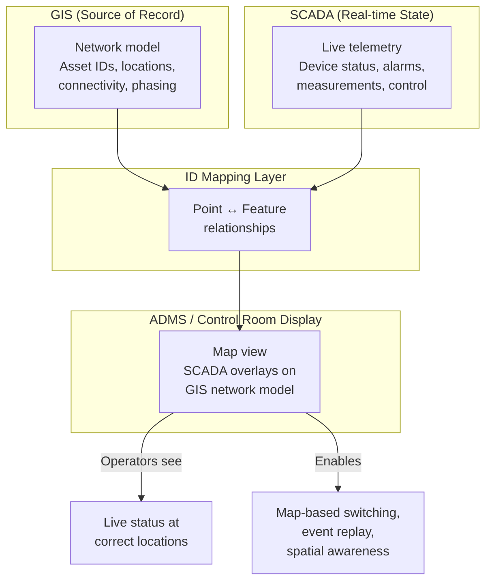

title: "SCADA Meets the Map: Making GIS–SCADA Integration Useful in the Control Room"
date: 2026-05-19T10:00:00-04:00
draft: true
tags: ["SCADA", "GIS", "ADMS", "Operations"]
cover:
  image: "/images/scada-gis/power-lines-sunset.jpg"
  alt: "Power lines at sunset"
  caption: "SCADA tells operators what is happening. GIS tells them where."
---

## Why operators care about maps

Most control rooms still live in SCADA point lists and one‑line diagrams. That works well when you know every device on your system by heart, but it's not great for spatial questions like "what exactly is under this storm cell?" or "where are all the open points on this feeder?" A screen full of alarms and tag names doesn't naturally show distance, access, or customer impact.

The moment you add a map that operators can trust, the conversation changes. The map stops being decoration and becomes a situational awareness tool: you can see where devices and customers are, how weather and fire risk overlap the network, and what a switching plan means in physical space, not just in the one‑line.

## What it means to integrate SCADA with GIS

In most utilities, SCADA and GIS evolved separately. SCADA is organized around points and RTUs; GIS is organized around features and assets. "Integration" is the work of making those two worlds line up in a way operators can rely on.

At a basic level, integrating SCADA with GIS means:

- **Mapping SCADA points to GIS assets and locations.**  
  Each SCADA point (for example `SUB01_SW123.Status`) needs a clear relationship to a specific GIS feature (the switch asset with a unique ID) and a location on the map. If you don't have stable, shared IDs between systems, everything else is a workaround.

- **Handling complex assets and stations.**  
  Substations and switching stations rarely map 1:1 between SCADA and GIS. A single physical structure might have multiple status points, measurements, and control tags. The integration has to cope with that: sometimes one GIS feature relates to many SCADA points; sometimes a logical SCADA device spans multiple GIS features.

- **Agreeing on sources of truth.**  
  GIS should be the source of truth for **identity, location, and connectivity**. SCADA should be the source of truth for **live status and telemetry**. ADMS, if you have it, sits on top and depends on both being consistent. When those roles blur without strong governance, the map stops matching what operators see in SCADA.

## How GIS, SCADA, and ADMS work together

## Patterns that help operators

### Visualizing alarms and statuses on a map

Alarms and status changes are much easier to understand when you can see them in context. Instead of a scrolling list of point names, operators can:

- See alarms grouped spatially along a feeder or around a substation.  
- Understand which customers and critical facilities sit behind a mis‑operating device.  
- Spot patterns (for example, everything tripping along a particular corridor) that are harder to see in a flat list.

The key is not to put every single SCADA point on the map, but to expose the **right subset** with clear symbology and filtering that operators can control.

### Map‑assisted switching with SCADA + ADMS logic

When SCADA status is aligned with the GIS/ADMS network model, you can use the map as part of the switching workflow:

- Show current open/closed state live on the map as operators step through a switching order.  
- Highlight the parts of the network that will be affected by each step before the command is sent.  
- Let operators verify that field reports and SCADA indications match the expected configuration.

Most of the value here is basic: "are we about to operate the device we think we are, in the place we think it is, with the consequences we expect?" The map helps answer that quickly.

### Event playback and post‑incident review

After a major event, teams often reconstruct what happened from SCADA logs and operator notes. When GIS and SCADA are integrated, you can replay the event on the map:

- Step through time and watch devices trip, close, and reconfigure on the network.  
- See how the event propagated spatially, not just in the sequence of points.  
- Use that playback during lessons‑learned sessions with operations, planning, and protection.

This doesn't require exotic analytics. It just requires that SCADA events can be reliably mapped back to the right GIS features and feeders.

## Anti‑patterns

There are a few recurring patterns that make GIS–SCADA integration look good on paper but fragile in practice.

- **One‑time mapping that goes stale.**  
  A project team does a big mapping push, imports everything into a viewer, and then moves on. New SCADA points, device replacements, and GIS edits accumulate over time, and no one is responsible for keeping the mapping current. The first time an operator clicks a device and gets the wrong point, trust evaporates.

- **No owner for point/feature relationships.**  
  If it's unclear whether GIS, SCADA, ADMS, or "integration" owns the point–feature mapping, you end up with a gray area where fixes fall through the cracks. Everyone assumes someone else will clean up mismatches and missing links.

- **Overloading operators with noisy layers.**  
  It's tempting to put every GIS layer and every SCADA point on the same map. The result is a view that looks impressive in demos and unusable in the control room. Operators need a clear, opinionated default that shows the essentials, with the ability to drill down when needed—not a GIS workstation dropped into SCADA.

## Keeping the integration healthy

Getting a good GIS–SCADA integration once is a project. Keeping it healthy is ongoing work.

- **Joint SCADA–GIS change management.**  
  Any change that affects a controllable device—new installations, retirements, renames, RTU upgrades—should trigger coordinated updates in both GIS and SCADA. That includes planning ahead for how new devices will be identified across systems, not just dropping them into each system independently.

- **Automation and exception reports.**  
  Simple automated checks can catch issues early: SCADA points with no GIS match, GIS devices flagged as SCADA‑controlled that are missing points, discrepancies between normal status in GIS and normal status in SCADA. Regular exception reports help both teams focus their limited time on the highest‑risk gaps.

- **Clear sign‑off on changes.**  
  When a change affects what operators see on the map or how they control a device, someone needs to own the final sign‑off. That's usually a joint responsibility across SCADA, GIS, and operations. The important part is that it's explicit, not assumed.

## Executive takeaways

Done well, GIS–SCADA integration is not a "nice visualization," it's part of how the control room sees and runs the network. It enables:

- Faster, more accurate situational awareness when things go wrong.  
- Safer and more confident switching, with fewer surprises.  
- Better post‑incident reviews and learning, because events can be replayed in space as well as time.  
- A more reliable foundation for ADMS, OMS, and DERMS, all of which depend on the same alignment between network model and real‑time state.

The technology pieces already exist in most utilities. The differentiator is usually not the tools, but the discipline around IDs, ownership, and keeping the integration healthy as the network and systems change.