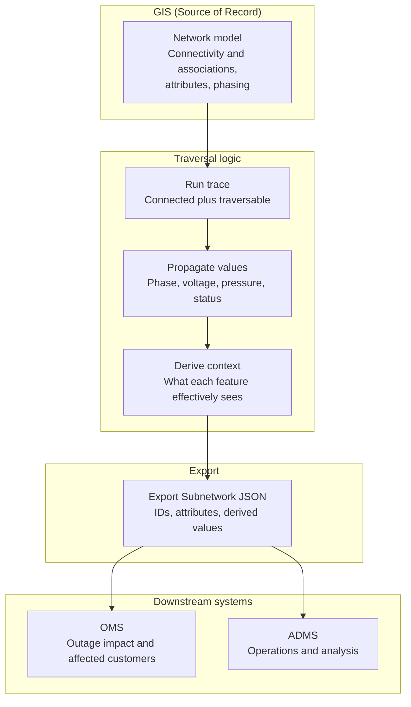

# Tracing Once, Using Everywhere: Propagated Values for OMS and ADMS

ArcGIS Utility Network tracing already gives us the path through the network, but OMS and ADMS usually need more than a list of traversed features. Export Subnetwork is intended to produce JSON that external systems can consume, and propagated values let that export carry network-derived answers instead of forcing those systems to recalculate them downstream.

## Traces are necessary, but not sufficient

A trace is great at answering a structural question: what is connected, and what can be traversed under the current rules. That matters for feeders, switching, outage impact, and operational analysis, but OMS and ADMS also care about the values each feature effectively sees as part of that traced path.

If all we send downstream is a feature list, every extractor, ETL job, or middleware layer ends up re-deriving context that GIS already knows. That is where integrations get heavier than they need to be, especially when the real requirement is simple and the network model already contains the logic needed to compute the answer.

## Connectivity, traversability, and propagation

It helps to keep three ideas separate. Export Subnetwork can return connectivity information based on network features connected through geometric coincidence or connectivity associations, while traces use network attributes and conditions to determine what is actually traversable.

- **Connectivity** is the structural graph: features are linked through geometric coincidence or valid associations in the network model.
- **Traversability** is connectivity plus rules: the trace only moves through connected features that satisfy barriers, status, phase, or other network-attribute logic.
- **Propagation** is the payoff: propagators derive values for features downstream of subnetwork controllers as features are traversed during update or analytic events.

That third part is what makes the result export-friendly for OMS and ADMS.

## Why OMS and ADMS need different values

OMS and ADMS often need values that are not a simple copy of what sits on an individual GIS feature, because the useful operational value is frequently a network-derived value rather than a stored edit value. Propagation lets you create measurable fields, assign network attributes, and optionally store propagated values such as an energized phase that is derived from traversal logic.

That difference matters in practice. GIS might store configured phase or asset settings one way, while OMS or ADMS needs the effective phase, limiting value, or downstream state as seen from the feeder or controller context.

## When code freezes block schema changes

I’ve worked with utilities, a GIS vendor, and an ADMS vendor where neither side wanted to make a schema change because a code freeze was already in place. The ask was usually simple, but the delivery path turned into custom extractor extensions, extra ETL logic, and middleware rules to solve something GIS could already reason about from the network.

That pattern is expensive because every downstream component ends up re-implementing a little bit of network intelligence outside the Utility Network. By contrast, propagation lets you configure how values are derived during traversal, and Export Subnetwork can emit JSON for external systems, which is exactly why propagating values for export feels so sweet in this integration space.

> **Code freeze reality**  
> When neither vendor wants a schema change, teams often compensate by extending extractors, layering ETL transforms, or teaching middleware to infer context that the network already knows. Propagated values shift that logic closer to the source by letting the trace or subnetwork export carry the answer downstream.

## Why propagation is the elegant option

Attribute propagation is configured in the Utility Network by defining fields, coded domains, inline network attributes, and propagators in the subnetwork definition so values can be derived as traversal occurs. Export Subnetwork also supports including network attributes and producing JSON for external systems, which makes it a natural handoff point for OMS and ADMS integration patterns.

That means you can change the **behavior** of the trace result without demanding a physical schema change in every connected system. In a frozen environment, that is often the difference between a clean configuration-driven solution and one more layer of custom logic that someone will have to maintain for years.

## A practical example

Imagine GIS stores configured phase on devices and lines, but ADMS really wants the effective energized phase as seen downstream from the controller. A common pattern is to pair a field such as “Phases Current” with an inline network attribute and an optional propagated field such as “Phases Energized,” using coded values for A, B, C, and their combinations.

In that model, the propagated value is derived during traversal rather than manually maintained on every feature. Once Export Subnetwork includes the relevant results, the integration can map the exported value into OMS or ADMS logic without adding another permanent field to every downstream schema.

## From trace to OMS/ADMS

This is the pattern I like most: trace once in GIS, propagate the values that matter, and export results in a form OMS and ADMS can consume. It keeps the network intelligence close to the network instead of scattering it across extractors, ETL, and middleware.

## Why this scales better

A static-field strategy sounds simple at first, but it tends to spread operational assumptions across multiple systems and teams. Propagation centralizes the logic in the Utility Network’s configuration, and Export Subnetwork provides a JSON-based delivery path for external consumers.

That is why I see propagated trace and subnetwork export results as more than a nice feature. They are a practical way to reduce unnecessary integration code when OMS and ADMS need values that differ from raw GIS storage or from what other downstream systems expect.