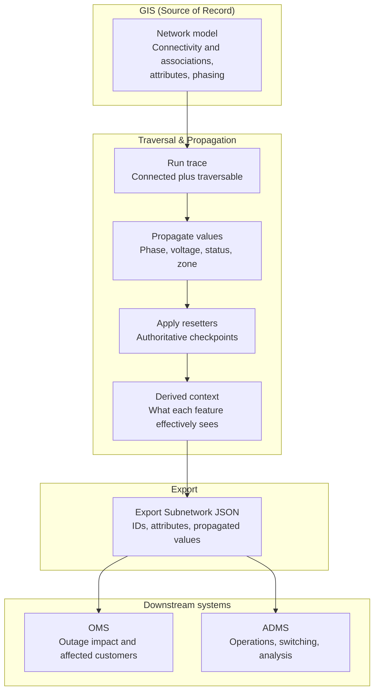

# Tracing Once, Using Everywhere: Propagated Values for OMS and ADMS

ArcGIS Utility Network tracing already gives us the path through the network, but OMS and ADMS usually need more than a list of traversed features. Export Subnetwork can produce JSON that external systems consume, and propagation lets that export carry network‑derived answers instead of forcing those systems to recalculate everything downstream.

ArcGIS Pro 3.7 and the 2026 Network Management Release finally closed a gap I’ve seen in a lot of OMS/ADMS projects. For years I’ve watched teams bolt on custom extractors, ETL, and middleware just to answer questions the Utility Network is already capable of answering:

- What’s actually energized on this feeder?  
- What does this device *see* from a phase/voltage perspective?

With new propagation capabilities wired into traces and Export Subnetwork, we can start treating GIS as **the place where network behavior is modeled**, not just where assets live.

## Traces are necessary, but not sufficient

A trace is great at answering a structural question: what is connected, and what can be traversed under the current rules. That matters for feeders, switching, outage impact, and operational analysis, but OMS and ADMS also care about the values each feature effectively sees as part of that traced path.

If all we send downstream is a feature list, every extractor, ETL job, or middleware layer ends up re‑deriving context that GIS already knows. That is where integrations get heavier than they need to be, especially when the real requirement is simple and the network model already contains the logic needed to compute the answer.

## Connectivity, traversability, and propagation

It helps to keep three ideas separate. Export Subnetwork can return connectivity information based on network features connected through geometric coincidence or connectivity associations, while traces use network attributes and conditions to determine what is actually traversable.

- **Connectivity** is the structural graph: features are linked through geometric coincidence or valid associations in the network model.  
- **Traversability** is connectivity plus rules: the trace only moves through connected features that satisfy barriers, status, phase, or other network‑attribute logic.  
- **Propagation** is the payoff: propagators derive values for features downstream of subnetwork controllers as features are traversed during subnetwork updates or analytic traces.

That third part is what makes the result export‑friendly for OMS and ADMS.

## Why OMS and ADMS need different values

OMS and ADMS often need values that are not a simple copy of what sits on an individual GIS feature, because the useful operational value is frequently a **network‑derived** value rather than a stored edit value.

A few examples:

- OMS cares which customers are affected on which phases behind a given protection device, not just the raw feature geometry.  
- ADMS wants the effective phase, limiting voltage, or downstream state as seen from the feeder or controller context, not just whatever is in a single asset field.  
- Both may expect “as‑energized” or “as‑operated” values that differ from simple as‑built configuration.

Propagation lets you create measurable fields, assign network attributes, and optionally store or export propagated values such as an energized phase that is derived during traversal, instead of being hand‑maintained on every feature.

## When code freezes block schema changes

I’ve worked with utilities, a GIS vendor, and an ADMS vendor where neither side wanted to make a schema change because a code freeze was already in place. The ask was usually simple, but the delivery path turned into custom extractor extensions, extra ETL logic, and middleware rules to solve something GIS could already reason about from the network.

That pattern is expensive because every downstream component ends up re‑implementing a little bit of network intelligence outside the Utility Network. By contrast, propagation lets you configure how values are derived during traversal, and Export Subnetwork can emit JSON for external systems, which is exactly why propagating values for export feels so sweet in this integration space.

> **Code freeze reality**  
> When neither vendor wants a schema change, teams often compensate by extending extractors, layering ETL transforms, or teaching middleware to infer context that the network already knows. Propagated values shift that logic closer to the source by letting the trace or subnetwork export carry the answer downstream.

## Why propagation is the elegant option

Attribute propagation is configured in the Utility Network by defining fields, coded domains, inline network attributes, and propagators in the subnetwork definition so values can be derived as traversal occurs. Export Subnetwork can then include those propagated values and other network attributes in a JSON payload that external systems can consume.

That means you can change the **behavior** of the trace result without demanding a physical schema change in every connected system. In a frozen environment, that is often the difference between a clean configuration‑driven solution and one more layer of custom code someone will have to maintain for years.

## A practical example

Imagine GIS stores configured phase on devices and lines, but ADMS really wants the effective energized phase as seen downstream from the controller.

A common pattern:

- A field such as `Phases_Current` holds configured phase.  
- An inline network attribute points at that field.  
- A propagated attribute such as `Phases_Energized` is defined.  
- A propagation function (for example, bitwise AND) carries energized phase along traversable paths based on controller values and device configuration.

In that model, the propagated value is derived during traversal rather than manually maintained on every feature. Once Export Subnetwork includes the relevant results, the integration can map the exported energized phase into OMS or ADMS logic **without** adding another permanent field to every downstream schema.

## Using propagation resetters in electric networks

ArcGIS Pro 3.7 and the 2026 Network Management Release also added **propagation resetters**, which let you mark places in the network where a propagated value should effectively “start over” instead of just inheriting whatever came from upstream. During a trace, when a feature with the *Propagator Resetter* network category is encountered, its own value becomes the new propagated value and is carried downstream from there.

In electric models, this is really useful anywhere the system intentionally re‑establishes conditions:

- **Downstream phase correction points**  
  Devices like tie switches, pad‑mount transformers, or switching cabinets can be treated as authoritative sources for `Phases_Current`. When you tag them as resetters, the propagated `Phases_Energized` value snaps to the device’s phasing at that point and continues from there, instead of letting messy upstream history leak through.

- **Voltage level transitions**  
  Primary‑to‑secondary transformers, voltage regulators, or network protectors can reset a propagated “Nominal Voltage” or “Voltage Tier” attribute. Upstream might be 12 kV, but once you hit the transformer marked as a resetter, the downstream network correctly carries 4 kV (or whatever the secondary level is) without complex rating logic across the whole path.

- **Feeder, zone, or section boundaries**  
  Breakers, reclosers, or sectionalizing devices that define a protection zone or logical section can reset attributes like “Section ID” or “Operational Zone.” Propagation then carries a clean section/zone identifier per chunk of the network, which maps much more naturally into OMS/ADMS logic.

- **Trusted checkpoints in noisy data**  
  In areas where upstream data is imperfect but a few devices have been surveyed and kept correct, marking those devices as resetters lets propagated attributes recover at known‑good points. The trace will “snap back to truth” there, instead of blindly inheriting upstream errors.

In other words, propagation resetters give you **authoritative checkpoints** for propagated attributes like phase, voltage, or operational zone. Combined with Export Subnetwork, that means OMS and ADMS can receive not just a propagated value, but one that has been corrected at the same key devices your field crews and operators already trust.

## From trace to OMS/ADMS

This is the pattern I like most:

- Trace once in GIS.  
- Propagate the values that matter (phase, voltage, status, zones).  
- Use resetters to keep those values honest at key devices.  
- Export results in a form OMS and ADMS can consume.

It keeps the network intelligence close to the network instead of scattering it across extractors, ETL, and middleware.

## Why this scales better

A static‑field strategy sounds simple at first, but it tends to spread operational assumptions across multiple systems and teams. Every time something changes, someone has to remember all the places those assumptions live.

Propagation and propagation resetters centralize the logic in the Utility Network’s configuration, and Export Subnetwork provides a JSON‑based delivery path for external consumers. That is why I see propagated trace and subnetwork export results as more than a nice feature: they are a practical way to reduce unnecessary integration code when OMS and ADMS need values that differ from raw GIS storage or from what other downstream systems expect.

---

If your integration diagrams have more boxes labeled “glue code” than actual systems, it might be time to let the trace engine do more of the thinking.