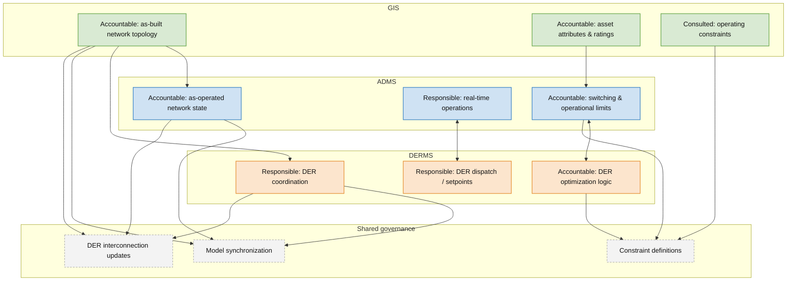

# ADMS vs DERMS vs GIS: Who Owns What in a High-DER Grid?

## The alphabet soup problem

In a high-DER grid, ADMS, DERMS, and GIS are all sometimes marketed as the system that will finally make the distribution network “smart.” That framing creates confusion, because these platforms are not interchangeable brains so much as distinct systems with different responsibilities, different time horizons, and different sources of truth.

The more useful question is not which platform is *the* brain, but which system owns which data, which operational decisions, and which model of the network. Once that boundary is clear, the architecture gets simpler, the integrations get cleaner, and governance becomes much easier to sustain.

## Clear roles in a high-DER architecture

A clean high-DER architecture starts by separating the **as-built**, **as-operated**, and **DER-optimized** views of the grid.

### GIS: the as-built system of record

GIS should own the authoritative representation of the physical distribution network:

- Asset location and connectivity
- Feeder, phase, and device relationships
- Equipment attributes and ratings
- Geospatial context for planning, design, and field operations

GIS answers a straightforward question: **what exists in the field, and how is it physically connected?** It is the long-lived source of truth for the network model, not the place to run real-time control.

### ADMS: the as-operated operational platform

ADMS should own the operating view of the network:

- Current switching state
- Topology processing
- SCADA integration and operator visibility
- State estimation and distribution power flow
- Operational applications such as FLISR and VVO

ADMS answers: **what is happening on the grid right now, and how should operators respond?** In most utilities, ADMS is where traditional distribution operations and operator authority live.

### DERMS: the DER coordination and optimization layer

DERMS should own the coordination and optimization of DER behavior across real-time and look-ahead horizons.

That includes functions such as:

- Planning studies for integrating new DERs
- Real-time monitoring and awareness of DERs
- Constraint management for voltage, thermal, and reverse power flow issues
- Optimization and dispatch of DER capabilities over present and future intervals

In practice, DERMS is less about replacing ADMS and more about extending utility operations into a world where generation is distributed, dynamic, and increasingly controllable.

## Why DERMS is data-hungry

DERMS only works well when it has enough system visibility to understand actual network conditions. As with VVO and FLISR, it can be implemented with both SCADA-based and distribution-power-flow-based approaches, but the power-flow-based model is generally more effective because it depends on state estimation and a fuller view of the feeder rather than sparse telemetry alone.

That matters because DERMS is supposed to manage problems such as:

- Under-voltage and over-voltage conditions
- Thermal overloads on transformers and line sections
- Reverse power flow
- DER-induced variability that changes feeder behavior faster than traditional planning assumptions can keep up

If the utility cannot see the state of the network with enough fidelity, DERMS becomes a blunt instrument. It may still provide value, but it will struggle to optimize confidently or intervene precisely.

### Typical DERMS inputs

A serious DERMS deployment usually depends on a wider set of inputs than many teams expect:

- Internal network model
- SCADA resources, including tap changers, capacitor banks, and DER settings
- Functional profiles and control policies
- Types and number of customers or DERs expected to be added
- Load curves and generation curves
- Weather data
- AMI data, including voltage readings, historical data, active power, and reactive power
- Exclusion lists and operating exceptions

This is also where GIS matters more than many DERMS conversations admit. A DERMS platform may optimize DER behavior, but it still needs a coherent network model, asset context, phase relationships, and a dependable physical topology baseline.

## Integration flows that make sense

With those roles in place, the integration pattern becomes much more intuitive.

### GIS to ADMS and DERMS

GIS should publish the authoritative as-built model outward:

- Topology and connectivity
- Equipment attributes and ratings
- Spatial context
- Feeder structure and phase detail

ADMS and DERMS can each consume that model, transform it for their own purposes, and add operational context. But neither should quietly become the long-term owner of the physical network record.

### ADMS and DERMS as an operational loop

The ADMS-DERMS relationship is where high-DER orchestration actually happens.

A practical pattern looks like this:

- ADMS supplies topology, state estimation, operating limits, and system constraints
- DERMS evaluates DER flexibility against those constraints
- DERMS computes recommended or automated actions for DERs
- ADMS and DERMS coordinate around safe execution and operator awareness

This interface is especially important when the utility is trying to manage voltage, thermal constraints, or reverse flow in near real time.

### Feedback to GIS when the physical network changes

Not every change belongs in GIS immediately, but every *physical* network change eventually must.

If new DER interconnections, equipment upgrades, feeder reconfigurations, or permanent asset changes are allowed to live only in ADMS or DERMS, the enterprise model begins to drift. That drift eventually breaks planning studies, interconnection analysis, and trust in every downstream system.

## What happens when roles blur

Role ambiguity usually starts as a convenience and ends as a governance problem.

### When DERMS builds its own network model

Some DERMS programs end up maintaining a parallel network model because it feels faster than waiting for enterprise model maturity. In the short run, that can accelerate deployment. In the long run, it usually creates duplicate topology logic, conflicting constraint calculations, and a second source of truth that someone eventually has to reconcile.

### When ADMS diverges from GIS

ADMS naturally needs an as-operated view that differs from the as-built model at any given moment. That is normal. The problem starts when temporary operational divergence becomes persistent structural divergence and no one can explain which edits are operational state versus permanent network change.

Once that line blurs, planners, operators, and IT teams start comparing different feeder realities.

### Operational consequences

When roles blur, the symptoms are familiar:

- Conflicting model results across planning and operations
- Duplicate maintenance effort across GIS, ADMS, and DERMS teams
- Lower trust in state estimation, power flow, and constraint calculations
- Slower DER integration because every exception turns into a model reconciliation exercise
- More governance meetings and more manual workarounds

At low DER penetration, teams can sometimes absorb that friction. At high DER penetration, it becomes a structural operating problem.

## Designing the governance

This is where a formal RACI can help. The point is not bureaucratic overhead; it is to prevent the utility from accidentally funding and governing three competing brains.

A useful governance principle is simple:

- **GIS owns the physical truth**
- **ADMS owns the operating truth**
- **DERMS owns DER coordination and optimization truth**

Everything important sits on top of that model.

## RACI grid

Below is a Mermaid-based RACI grid you can embed directly in Hugo. It uses a flowchart as a visual matrix because Mermaid does not provide a native RACI chart type, but this pattern renders well and is easy to maintain in Markdown.

Read the grid this way:

- **A = Accountable** for the authoritative decision or record
- **R = Responsible** for execution
- **C = Consulted** as an active participant in the decision or process
- **I = Informed** but not driving the work

The most important architectural signal in the matrix is that GIS remains accountable for the as-built network model, ADMS remains accountable for operational state and grid operations, and DERMS becomes responsible and accountable for DER-specific optimization and dispatch.

## How to use the RACI in practice

The matrix is only useful if it changes how work is governed.

A practical operating model usually includes:

- A controlled process for publishing network model changes from GIS into ADMS and DERMS
- A clear rule for what constitutes temporary operational state versus permanent physical change
- Named owners for DER participation data, control policies, and exclusion lists
- Formal review points when new DER programs or feeder constraints affect more than one platform

In other words, the architecture and the governance model should be designed together.

## Executive takeaways

High-DER utilities do not need three competing brains. They need a clean division of labor.

- GIS should remain the system of record for the physical network
- ADMS should remain the system of operation for the live grid
- DERMS should manage DER awareness, constraint response, and optimization
- Data should move deliberately between the three, not accumulate in parallel models
- Governance should define ownership before integration complexity forces the issue

If a utility gets these boundaries right early, DERMS becomes much easier to scale. If it gets them wrong, the organization spends years untangling model drift, duplicate logic, and control ambiguity.
