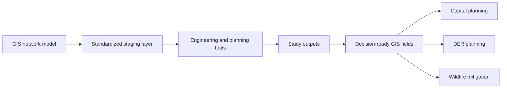

## Studies are only as good as the model they receive

Every major grid decision now starts with a study: can the system handle new load, more DER, wildfire risk, or a major capital project? Those studies are only as good as the network model they are fed.

In many utilities, that model is still built by hand in engineering tools from one-off GIS exports. The process is fragile, slow, and dependent on a few people who know how to clean things up each time. Engineers learn to distrust GIS data, and they spend their time repairing the model instead of answering the business question.

> “Systems are now more capable than people, and the ordinary incremental growth rate in skills within an organization does not keep up with developments in technology.” — Roger Tomlinson, *Thinking About GIS: Geographic Information System Planning for Managers*

That observation still holds. In many organizations, the gap is not the software. The gap is that departments, standards, and workflows have not matured at the same pace as the tools. The result is duplicated effort, rework, and a planning process that depends too heavily on translation between siloed teams.

The better approach is to turn this into a repeatable pipeline, where GIS reliably provides a clean, connected model that planning and engineering tools can use without heroics.

## What planning and engineering tools need from GIS

From an executive perspective, planning and engineering tools need three things from GIS:

- A network that is actually connected end to end, not just lines on a map.
- The right level of detail for planning and analysis.
- Consistent identifiers, naming, and asset definitions across the system.

This is mostly about standards and discipline, not software. If an overhead service drop is modeled one way in one district and another way somewhere else, planners cannot trust that a system-wide study is using the same assumptions. If a switch type can appear under multiple names, asset counts and constraints will never quite line up.

The technical work may happen through schema changes, attribute rules, and automation, but the leadership principle is simple: model assets one way, agree on the standard jointly, and enforce it.

## Designing a repeatable pipeline

Instead of exporting data only when someone asks for a study, utilities need a predictable flow from GIS into engineering and planning tools.

At a high level, a mature pattern looks like this:

- GIS serves as the source of truth for network location, connectivity, and asset identity.
- A standard export or integration layer transforms that network into study-ready models on a regular cadence.
- Every study is tied to the exact version of the model it used, so decisions can always be traced back to a known dataset.

That shift matters because it turns a manual handoff into a repeatable business process. It reduces rework, improves trust, and makes it easier to rerun studies when assumptions change.

## Turning disparate datasets into one picture

Every major planning question now depends on more than the network model alone. Utilities are trying to combine asset records, outage history, AMI and SCADA feeds, vegetation and wildfire risk, DER applications, customer growth, and land-use change into one decision process.

On their own, these are disparate datasets that live in different systems and tell only part of the story. GIS is where they can be brought together, because location provides the common frame that lets the organization compare engineering results, operating history, environmental exposure, and future growth in one place.

That matters because leaders rarely need another isolated dataset. They need one view that explains where the grid is under stress, where conditions are changing, and where investment will have the greatest effect.

## Putting study results back into GIS

A mature integration does not stop when GIS feeds the study. Some of the most useful study outputs should come back into GIS as decision-ready fields that planners and leaders can use in daily prioritization.

For capital planning, that can include indicators such as constraint severity, expected year of overload, recommended project type, and study confidence. Once those values are visible on the map, teams can compare modeled need against growth, project cost, outage history, and other investment drivers.

For DER planning, GIS can hold practical planning signals such as available capacity bands, voltage sensitivity flags, backfeed concerns, and areas that require more detailed review. That gives planning, interconnection, and customer teams a shared spatial picture of where DER is easier to support and where the system will need reinforcement.

For wildfire mitigation, study outputs can be paired with exposure, vegetation, terrain, and weather-driven risk layers. The result is a far more actionable picture of where system conditions and environmental risk overlap, helping utilities prioritize hardening, sectionalizing, inspections, and operational changes.

The key is not to write every engineering output back into GIS. The goal is to return the small set of fields that improve prioritization and make system need visible in the same environment where other business risk is already understood.

## Using GIS analytics to see emerging hot spots

This is where GIS becomes more than a repository. Modern GIS platforms have strong spatial and spatiotemporal analysis tools that can reveal where problems are clustering and where risk is growing over time.

Instead of looking at one study or one event in isolation, utilities can layer years of study outputs, outages, DER requests, load growth, inspections, and wildfire conditions to identify emerging hot spots. Those hot spots are often the places where multiple issues are converging: rising demand, repeated constraints, worsening reliability, and increasing environmental exposure.

That kind of analysis is especially valuable for capital planning, DER strategy, and wildfire mitigation because it helps answer a more strategic question: not just where the grid has a problem today, but where pressure is building fastest.

## Pitfalls

There are a few warning signs that a utility has not yet matured this process:

- Only one or two people know how to get a usable model out of GIS.
- Engineers maintain separate shadow models because the GIS version is not trusted.
- Different groups use different names, assumptions, and asset definitions for the same equipment.
- Study results stay buried in reports instead of being reused in GIS and planning workflows.

When those conditions exist, the organization pays for the same translation work over and over again. More importantly, every major study takes longer and carries more avoidable uncertainty.

## Executive takeaways

For leadership, the goal is not to understand every engineering field or study parameter. The goal is to shorten the path from “we have a system question” to “we have a defensible answer we can act on.”

A mature GIS-to-studies integration helps utilities:

- Reduce the cycle time for planning and engineering studies.
- Improve confidence that decisions are based on current and consistent network data.
- Combine disparate datasets into one decision framework.
- Make study outputs reusable for capital planning, DER strategy, and wildfire mitigation.
- Identify emerging hot spots early enough to act before they become larger operational or financial problems.

The real value is not better exports. It is better decisions, supported by a shared and repeatable view of how the grid is built, how it is changing, and where the next investment should go.