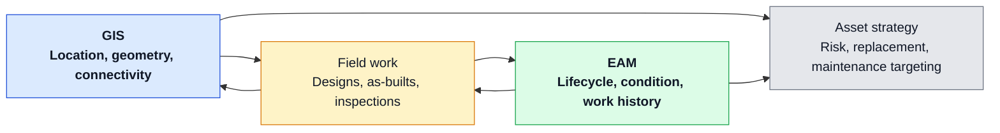

# GIS + EAM: Turning As-Built Edits into Asset Strategy

## The GIS–EAM integration gap

Many utilities have both GIS and EAM, but they still behave like neighboring countries: one for maps, one for work.

GIS usually knows where the asset is, how it is connected, and what the network looks like. EAM usually knows what the asset is in lifecycle terms, what work has been done to it, and what is supposed to happen next. On paper, that is complementary. In practice, the two systems are often tied together by partial syncs, manual re-entry, and workflows that depend more on tribal knowledge than design.

The result is two half-stories about the same assets instead of one shared asset strategy.

That used to be mostly a maintenance and data quality problem. It is starting to become something bigger.

Tracking and traceability has long been treated as a gas problem. That makes sense. Gas had clear safety and regulatory pressure to know exactly what was installed, where it came from, and how it got into the ground. Electric never built the same discipline at the same level. But wildfire mitigation is changing that, especially across the Pacific Northwest and West Coast. Once wildfire mitigation starts showing up in ADMS, PSPS workflows, hardening plans, vegetation programs, and operating procedures, the question is no longer just where the asset is. It is whether the utility can trace that asset well enough to trust the decision attached to it.

## Core integration patterns

The goal is not “real-time sync everywhere.” The goal is to make GIS and EAM tell the same asset story at the moments that matter.

### Shared asset IDs and lifecycle states

Mature integration starts with three boring things: IDs, field mappings, and lifecycle states.

You need a consistent way to represent the same pole, transformer, switch, fuse, recloser, or conductor segment across both platforms, and a shared language for the states that matter: planned, under construction, commissioned, in service, retired, abandoned, replaced.

If that sounds basic, it is. But without it, every downstream process becomes ambiguous. A replacement might exist in GIS but not in EAM, or an asset may be retired in EAM while still active in the map. Shared IDs and status triggers are what make commissioning and retirement workflows work cleanly instead of “close enough.”

### Construction and commissioning flows

This is where integration stops being a data exercise and starts affecting real work.

Designs become work, work becomes construction, construction becomes as-built, and that as-built needs to update both the network model and the asset record. In a weak integration, GIS is updated when someone has time and EAM is updated separately, often by a different team. In a stronger model, completion and commissioning events trigger coordinated updates so the asset shows up in the right place, in the right state, with the right history attached on day one.

### Retirements and replacements

Replacement programs expose weak GIS–EAM integration fast.

A utility may know an old asset was retired in EAM, but if GIS still shows it connected and active, downstream users inherit a false network. The reverse is just as bad: GIS may show a replacement in place while EAM still points maintenance plans, inspection history, and reporting logic at the old asset.

The right pattern is to treat retirements and replacements as paired lifecycle events with explicit mapping rules. You keep the history you need, but the active network and the active asset base move forward together.

## Making field work count twice

One of the best tests of GIS–EAM integration is simple: does every field visit make both systems better, or just one?

### Designs and as-builts updating GIS and EAM

Field construction and as-built edits should not stop at “the map is fixed.” They should also update the lifecycle and maintenance reality of the asset in EAM.

If a new transformer is installed, GIS should reflect the geometry and connectivity while EAM reflects the asset record, status, installation details, and future maintenance context. That is what turns as-built editing from cartographic cleanup into asset strategy.

### Using inspections and work orders to improve GIS

The loop should run the other way too.

Inspection and work execution often surface the most useful reality checks a utility gets: wrong material, wrong size, missing asset, bad location, incorrect status, or a configuration mismatch. If that information dies inside the work order, GIS stays less trustworthy than it should be.

Integrated mobile and sync patterns help because crews see current GIS and EAM data together, then push one validated update that improves both, instead of creating two separate correction queues.

### GIS views to drive inspection and maintenance programs

Location is not just a display field. It is a planning variable.

Once GIS and EAM are connected, utilities can use map-based views to drive inspection and maintenance programs more intelligently—for example by grouping nearby work, targeting high-risk corridors, or prioritizing assets in areas with recurring issues.

That matters even more in wildfire territory. If a utility is adding wildfire mitigation logic into ADMS and adjacent operational systems, then field condition, asset lineage, inspection history, and geography all start to matter at the same time. A decent map is not enough. You need traceability you can operate on.

## A simple integration view

The point is not to synchronize everything all the time. The point is to make sure the same field event improves both the network model and the asset record, and that both of those improvements show up downstream in asset strategy.

If a field event only updates one system, you are paying twice for half the value.

## Analytics from GIS + EAM

This is where the integration starts paying for itself.

### Spatial risk and condition mapping

Once location and lifecycle are joined, utilities can visualize asset condition, maintenance backlog, inspection findings, environment, and consequence together.

That matters for wildfire mitigation, vegetation interaction, hardening, and resilience planning, where risk is spatial by definition, not by convenience. If a utility cannot tie condition, location, history, and program context together, then its wildfire strategy is going to lean too heavily on broad rules instead of asset-level judgment.

### Outages and failures tied to asset cohorts

A more mature integration also makes it easier to look at failures by cohort: material, age band, manufacturer, installation program, geography, or maintenance history.

When outages and failures are tied back to mapped asset populations, utilities can start seeing where patterns are systemic instead of anecdotal. That is the difference between replacing bad actors one at a time and understanding which combinations of asset type, vintage, environment, and maintenance history are actually driving reliability and fire risk.

### Informing replacement strategies

Replacement strategy gets better when it is informed by both condition and place.

EAM tells you what work happened and how the asset is aging. GIS tells you where it sits in the network, what customers it affects, what environment it is exposed to, and what other risk layers overlap it. Put together, that creates a stronger basis for capital planning: not just replacing the oldest assets, but replacing the ones that are oldest, most failure-prone, most consequential, or most exposed.

That is where the gas comparison starts to matter. Gas learned to care about traceability because it had to know exactly what was in the ground and where. Electric is starting to learn the same lesson through wildfire. Once operating decisions depend on asset lineage, “good enough” asset records stop being good enough.

## Governance and ownership

This is one of those integrations that fails less from technology than from unclear ownership.

A simple rule helps: GIS should own **location, geometry, connectivity, and network context**. EAM should own **lifecycle, condition, maintenance history, and work execution status**. Both systems need shared identifiers, shared standards, and explicit change processes so that a change in one system propagates correctly to the other.

The hard part is not deciding that in principle. The hard part is writing down which events trigger which updates, who resolves exceptions, and how replacement, abandonment, commissioning, and asset lineage are handled when the two systems disagree.

Wildfire mitigation raises the stakes here. If GIS and EAM cannot agree on what an asset is, where it is, what state it is in, and what has happened to it, then the utility is trying to run risk-based operations on top of partial truth.

## Executive takeaways

The ROI from GIS–EAM integration does not come from synchronization for its own sake. It comes from making every as-built edit, inspection, and work event count twice: once for GIS, once for EAM.

A mature utility should expect value in a few places:

- Better construction-to-commissioning workflows, with fewer gaps between what was built and what is now maintainable.
- Better maintenance planning because crews can see asset, location, and nearby work in one operating context.
- Better capital decisions because failures, condition, environment, and consequence can be analyzed together on a map, not in separate spreadsheets.
- Better wildfire strategy because asset lineage, field history, and geography can support more defensible operating and mitigation decisions.
- Better data quality because GIS and EAM stop drifting into separate versions of the asset story.

The win is simple: GIS + EAM turns as-built edits from recordkeeping into strategy.

And in the West, where wildfire mitigation is pushing more asset-aware logic into operations systems, that strategy starts to look a lot less optional.
