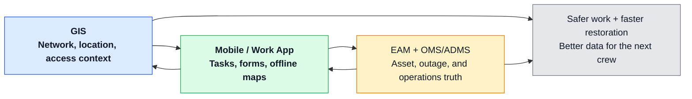

# Field-Ready Data: Closing the Loop Between GIS and Mobile / Work Management

## Why crews don’t trust the map

On my first day as a lineman apprentice in a union shop, a seasoned journeyman took me to the hood of his truck and pulled out his circuit map.

It was covered in coffee stains, highlighter, and red scribbles. He handed me a freshly printed map and told me to copy everything over.

That told me almost everything I needed to know.

The official map existed. But the *real* operating map — the one people trusted — lived in the truck. It carried the things the enterprise systems were missing: the locked gate behind the easement, the hostile household, the angry dog, the switch that never quite behaved the way the model said it did, the suspect fuse that usually fixed the problem faster than OMS logic, the shortcut that saved an hour in a storm, the note that kept someone from walking into a bad situation.

That gap is not just inconvenient. It is a safety problem and a reliability problem.

When crews do not trust the map, they build their own. They carry local knowledge in notebooks, truck binders, phone photos, and memory. Sometimes that knowledge keeps people safe. Sometimes it restores power faster than the official system can. But when it stays trapped in those informal channels, the utility ends up running on parallel truths.

Mobile and work management apps are supposed to close that gap. Sometimes they do. Sometimes they just digitize the same distrust. If the field app is clumsy, the symbology is confusing, offline performance is weak, or submitted updates disappear into a backlog, then the tablet becomes just another version of the wrong map.

## What field really needs from GIS

Field users do not need the full GIS. They need a version of the network they can actually trust when they are standing at the truck, at the gate, or on the pole.

### Simple, accurate network views

Crews need a task-ready view, not a desktop map shrunk onto a tablet.

That means:

- Clear feeder and device context
- The right nearby assets
- Connectivity that makes sense in the field
- Enough detail to work safely without drowning people in background layers

A field map should help someone answer practical questions fast: Am I in the right place? Is this the right device? What else around me matters? What should I be careful of before I start working?

### Offline capability and clear symbology

Offline is not optional. Utilities send people into canyons, mountains, storm zones, basements, rural corridors, and neighborhoods with weak or no coverage. If the map works only when connected, crews will stop depending on it the moment things get real.

Symbology matters too. A technically accurate map can still fail if it is hard to read under pressure. Field users need to distinguish what matters at a glance:

- Open vs closed
- Existing vs retired
- Primary vs secondary
- Safe access vs problematic access
- Inspection complete vs inspection due

In the field, visual clarity is part of safety.

### Reliable link between work orders and GIS features

A work order should not send a crew on a scavenger hunt.

The field experience works best when the work order, the asset, and the map are tightly connected:

- The work order points to the right GIS feature
- The map opens with the right context
- The asset record and prior notes are easy to reach
- The user does not have to re-enter the same information three times

That sounds basic, but it is one of the biggest differences between systems crews tolerate and systems they rely on.

## Designing the loop

The point of the loop is not just to give the field more information. It is to get the right truck, with the right skills and the right tools, to the job site the first time — and to make sure what the crew learns out there actually improves enterprise truth.

### GIS to mobile: work, context, and safety info

The outbound side of the loop should deliver more than a pin on a map.

It should give crews:

- Work location and asset context
- Relevant switching or outage context
- Known access issues
- Safety notes
- Inspection history
- Nearby related assets
- The right forms and tasks for the job

This is where a lot of hidden field knowledge should start surfacing in a structured way. Locked gates. Dogs. Hostile customers. Access constraints. Equipment oddities. The fuse that tends to be the real problem. The switch that operations logic may not rank highly but crews know to check first.

Some of that information is sensitive and should be governed carefully. But pretending it should live only in memory is not safer. It just makes safety and reliability dependent on who happens to be on the truck that day.

### Field to GIS, EAM, and OMS

The loop back matters just as much.

What the crew sees in the field should be able to improve:

- GIS, when the network model is wrong
- EAM, when asset condition or lifecycle status changes
- OMS/ADMS, when operational understanding needs to catch up to reality

That includes:

- As-built edits
- Asset status updates
- Inspection results
- Exceptions and discrepancies
- Access and safety issues
- Reliability-relevant notes that should not die with the crew’s memory

A healthy loop does not just collect work completion. It collects operational truth.

### Avoid photo-only updates with no structure

Photos are useful. Notes are useful. But neither is enough on its own.

If the only output from the field is a photo roll and a text comment, the utility has not built a data loop. It has built a digital shoebox.

The right tool depends on the workflow:

- Structured forms for inspections
- Guided redlining for as-builts
- Validation workflows for field-observed discrepancies
- Controlled note types for safety and access issues
- Photos as supporting evidence, not the primary data model

That is how you avoid replacing paper backlogs with digital backlogs.

## A simple loop

The point is not to put a map on a tablet. The point is to make sure the same field event improves safety, reliability, and enterprise data all at once.

## Patterns that work

A few patterns tend to separate useful field systems from systems that just look modern in demos.

### Structured redlining and validation

Structured redlining works because it captures what the field sees without pretending every field user should be a network model editor.

A good pattern is:

- Crew flags a discrepancy
- Crew attaches evidence
- The system routes it for validation
- The right team updates the authoritative model
- The result is visible back to the field

That is how the organization starts earning trust back. The field sees that corrections do not just disappear.

### Clear boundaries for what can be edited in the field

Not everything should be editable from a mobile device.

Some workflows should allow direct field edits:

- Inspection results
- Status confirmations
- Certain condition fields
- Certain as-built attributes
- GPS-based location corrections under controlled rules

Other workflows should focus on validation only:

- Complex connectivity edits
- Broad model changes
- Network-affecting updates that need specialist review

That boundary matters because data quality matters too. The goal is not uncontrolled editing. The goal is the right level of field contribution without breaking connectivity or attribute integrity.

### Coordinated updates across GIS, OMS/ADMS, and EAM

The loop only really closes when updates propagate where they need to go.

If a field crew confirms an asset is retired, rerouted, mis-modeled, inaccessible, unsafe, or repeatedly implicated in reliability issues, that information should not die in one workflow queue. It should reach the systems that care:

- GIS for network truth
- EAM for lifecycle and maintenance truth
- OMS/ADMS for operational truth where relevant

That is how field knowledge becomes enterprise knowledge instead of folklore.

## Organizational issues

This is where the technology story usually breaks down.

### Training and expectations

Crews need to know not just how to use the app, but why the loop matters.

They already understand the practical side. They know that bad maps slow restoration, create rework, and put people in bad spots. What they need to see is that the system is finally built to learn from them instead of making them carry the burden alone.

Office teams need training too. If no one is ready to validate and reconcile field input quickly, crews learn fast that submitting good updates is not worth the trouble.

### Incentives and metrics for data quality

You get the behavior you measure.

If the only thing that counts is jobs closed, then quality of field updates will always lose. Healthy programs measure things like:

- Quality of completion
- Structured update rates
- Validation backlog age
- Repeat discrepancies on the same assets or circuits
- Time from field observation to enterprise correction

That tells the organization whether the loop is real or just aspirational.

### Avoiding “we’ll fix it later in GIS” culture

This culture kills trust faster than bad software.

“We’ll fix it later in GIS” usually means the crew found something important, the enterprise system was wrong, and no one has real ownership of closing the loop. After enough repetitions, people stop submitting corrections and go back to marking up paper, saving photos, or relying on whoever has been on that circuit the longest.

That is how the coffee-stained hood map keeps winning.

### Capturing knowledge before it retires

There is another pressure building under all of this.

The senior linemen, electricians, relay technicians, and troubleshooters who keep the lights on are retiring faster than many utilities are hiring and training the next generation.

A lot of what they know lives in those truck maps and in the muscle memory of how they run a circuit. When they walk out the door, that knowledge walks with them.

A robust field mobility program, integrated tightly with GIS, EAM, and ADMS/OMS, is not just a technology project. It is one of the few practical ways to capture and reuse that experience at scale:

- Turning hood-map scribbles into structured, shareable data
- Embedding “first checks” into workflows instead of hoping the next person remembers
- Making sure every field job leaves the system a little smarter for the next crew

We are not going to replace these people one-for-one. The least we can do is stop letting their knowledge retire with them.

## Executive takeaways

A healthy GIS ↔ field loop is not just about mobility. It is about safety, reliability, and operational trust.

You should expect to see:

- Simple, legible, offline-capable maps crews can trust
- Strong linkage between work orders, map context, and asset records
- Structured capture of as-builts, inspections, exceptions, and safety/access issues
- Clear rules for what the field can edit directly vs validate for review
- Coordinated updates across GIS, EAM, and OMS/ADMS
- A visible process that proves field knowledge actually improves enterprise data

The test is simple: when the field learns something important, does the system learn too?

When the answer is yes, crews trust the map more because they can see it getting smarter. When the answer is no, the real map goes back onto the hood of the truck.
